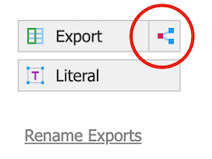

# Slate to AppEnhancer (BDM) Import

This project automates the process of fetching document records from a Slate query, downloading the associated PDF files, and importing them into OpenText AppEnhancer (formerly AppXtender) via its REST API.

Earlier versions of AppExtender/AppEnhancer can be used but may not support the PDF decryption feature which is required to be able to use the annotation features of AppExtender/AppEnhancer. Without the PDF decryption feature of AppEnhancer 24.4, any documents uploaded may not allow annotations since the document is encrypted by Slate using Adobe DRM to prevent editing. 

## Features

- **SQLite Tracking:** Every record is tracked in a local SQLite database (`records.db`) with an auto-incrementing ID.
- **Dynamic Metadata:** AppEnhancer field mappings and SQLite columns are dynamically generated from the `config.json` file.
- **Searchable Database:** Metadata for every student/document is stored in individual columns in the SQLite database for easy auditing and reporting.
- **Archiving:** Successfully imported documents are moved to a dated archive directory along with their original JSON metadata.
- **Retries:** Configurable retry logic for both file downloads and API uploads.
- **Duplicate Detection:** Automatically handles "Duplicate Index" errors from AppEnhancer (Error 125) by marking them as such and moving on.
- **Summary Emails:** Sends a detailed execution report at the end of each run to one or more recipients.
- **CLI Overrides:** Easily override the AppEnhancer Base URL, Datasource, App ID, and URL parameters from the command line.
- **Automatic Cleanup:** Periodically removes old archive files, old log files, and clears the downloads directory after each run.

## Prerequisites

- Python 3.6+
    - `requests` library: `pip install requests`
- OpenText AppEnhancer Web Access 24.4
- OpenText AppEnhancer Administrator 24.4
- OpenText AppEnhancer REST Services 24.4
- Slate CRM
    - You will need the ability to create a query, or have someone create one for you.

## Configuration

The script relies on a `config.json` file. Use `config.example.json` as a template. Rename or copy the file to `config.json`.

### Key Configuration Sections

- **Slate API:** URL, Query ID, and Bearer Token for your Slate instance.
    - **Slate Material URL:** The field name used in the Slate query to output the material download URL. 
- **AppEnhancer API:**
    - `appenhancer_base_url`: The root URL of the REST API.
    - `appenhancer_datasource`: The target datasource (e.g., "TEST" or "PROD").
    - `appenhancer_appid`: The target App ID (e.g., "509").
    - `appenhancer_urlparams`: Additional query parameters (e.g., `importOption=DecryptPDFFile`).
        - In order to utilize document annotations, you must use the `importOption=DecryptPDFFile` parameter since PDFs from Slate are encrypted. 
            - This `importOption=DecryptPDFFile` parameter is not available in AppXtender 20.4 or below per my testing. It was not tested on AppEnhancer 23.4, but was tested using AppEnhancer 24.4. Uploads should still work on older versions using the API endpoint but the PDF may not be decrypted and may not show the annotation tools when viewed in AppXtender/AppEnhancer. Just omit the `importOption=DecryptPDFFile` parameter if you are on an older version of AppXtender/AppEnhancer.
- **SMTP Settings:**
    - `smtp_to`: A single email or a comma-separated list of recipients (e.g., `"admin1@school.edu, admin2@school.edu"`).
- **Cleanup Settings:**
    - `days_to_keep_archive`: Number of days to retain archived documents.
    - `days_to_keep_logs`: Number of days to retain log files.
- **Metadata Mapping:** Defines how Slate JSON keys map to AppEnhancer Field IDs and SQLite database columns.

```json
"metadata_mapping": [
  {"field_id": "field1", "slate_key": "ID", "db_column": "student_id"},
  {"field_id": "field4", "slate_key": "LASTNAME", "db_column": "last_name"}
]
```

## Usage

### Basic Run
```bash
python3 slatetobdmax.py
```

### Dry Run (Simulated Processing)
Simulate the run without uploading to AppEnhancer, archiving files, or modifying the SQLite database. New Slate records are simulated in-memory.
```bash
python3 slatetobdmax.py --dry-run
```

### Verbose Logging
```bash
python3 slatetobdmax.py --verbose
```

### Command Line Overrides
You can override target parameters without changing the config file:
```bash
python3 slatetobdmax.py --baseurl "https://prod.school.edu/AppEnhancer/api" --appid 600 --datasource PRODUCTION --urlparams "importOption=DecryptPDFFile"
```

## Database Schema

The `records.db` table `records` includes:
- `id`: Auto-incrementing primary key.
- `filename`: Unique filename from Slate (marked as UNIQUE).
- `status`: PENDING, SUCCESS, DOWNLOAD_FAILED, UPLOAD_FAILED, DUPLICATE.
- `attempts`: Number of times the upload was attempted.
- `raw_json`: The full original record from Slate.
- **Metadata Columns:** Dynamically added based on your `metadata_mapping`.

## Maintenance

- **Logs:** Stored in the `logs/` directory, organized by Year/Month. Automatically cleaned based on `days_to_keep_logs`.
- **Archives:** Successfully processed documents and their `.json` metadata counterparts are stored in the `archive/` directory. Automatically cleaned based on `days_to_keep_archive`.
- **Downloads:** The `downloads/` directory is automatically cleared at the end of every run.
- **Schema Updates:** Adding a new field to `metadata_mapping` in `config.json` will automatically add the corresponding column to the SQLite database on the next run.

## Support
If a record fails repeatedly, check the `last_error` column in `records.db` or the log file for the specific API response from AppEnhancer.

## Slate Setup

This script relies on the Queries/Reports functionality of Slate. You must have access to build a query or request a Slate administrator to build a query for you. 

1. Login to the Slate admin page
2. Go to the Queries page
3. Click `New Query`
4. Start building your query to meet your needs
    - This part is mostly left to your own discretion. You should match these fields with the ones in your AppEnhancer application. At minimum, you will need the required fields from your AppEnhancer application.
5. Add a PDF field to your query
    - *NOTE:* This will add a link to a PDF of the document uploaded by the student. It is only a link and not the full binary PDF file. The script will take care of downloading the PDF from the link.
    1. Open the query editor.
    2. Under the Exports section, click the Subquery button on the right side of the Export button.
        <br>
        
    3. Follow the Single Material tutorial from [this site](https://resource.reworkflow.com/books/slate/page/material-download-link).
        - *NOTE:* On step 3 of the Instructions section, you should add the base URL of your Slate instance before `/apply/download.pdf`.
            - ex. `https://slate.univ.edu/apply/download.pdf` 
    4. Name the field the same as the `slate_material_url_field` value in `config.json`. 
        - ex. `MaterialURL`
6. After building the query, enable the web service to create an API endpoint. See the [Slate documentation](https://knowledge.technolutions.net/docs/exporting-data-with-web-services) for more information.
    1. In the `Edit Query` page, click `Edit Permissions`.
    2. Click `Add Grantee`.
    3. In the Edit Grantee window:
        1. For `Active`, choose `Active`.
        2. For `Type`, choose `User Token`. 
        3. Enter a name.
        4. Leave the token set to the randomly generated value. You will need this token for the script config so store it in a secure place.
        5. If you want to lock down the API endpoint to a certain IP, enter the IP address or range under `Allowed Networks`.
        6. For `Permissions`, enable `Web Service`.
        7. Click `Save`.
7. Once saved, a `JSON` link will appear in the `Edit Query` page under `Web Service`.

## AppEnhancer Setup 

To use the AppEnhancer API, an AppEnhancer username and password must be created with the correct privileges. This must be done by an AppEnhancer administrator in the AppEnhancer Admin app. You must also have the AppEnhancer REST Services application installed on the server.

Before uploading a document, you must also have an AppEnhancer application within a data source to upload the document to.

1. Login to `AppEnhancer Admin`
2. Go to `Application Management` and expand the data source that contains the application you wish to use
3. Click `Users` under the data source
4. Click `Add`
5. In the `User` tab, enter a username and password for the account. The full name field is optional. 
6. In the `Profile` tab, select the application that files will be uploaded to.
    1. Click the `No Privilege` button to erase all of the checkboxes.
    2. Under the `Privileges` section, enable the following checkboxes:
        - Scan/Index Online  
        - Batch Scan  
        - Batch Index  
        - Modify Index  
        - Display 
        - Delete Doc 
        - Add Page
7. Click `Save`